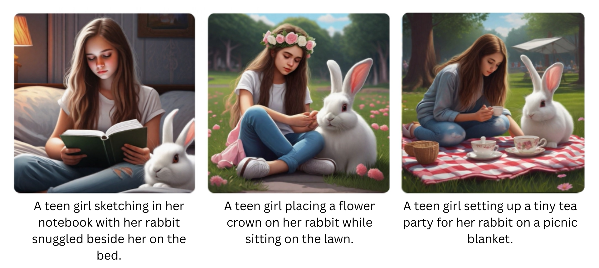
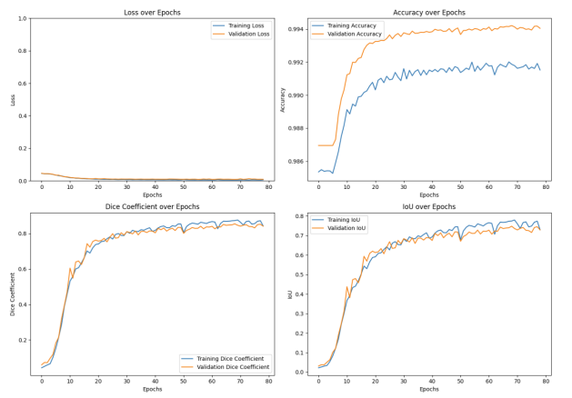

# 👋 Hi, I'm Thathsarani Sandarekha

I'm a passionate and performance-driven **Aspiring Machine Learning Engineer** with a **BSc (Hons) in Artificial Intelligence and Data Science** from Robert Gordon University (UK). My work bridges academic research and real-world AI deployment, specializing in **computer vision**, **generative models**, and **LLM-powered systems**.

I love building intelligent systems that don’t just work—but wow. From designing memory-augmented diffusion models for visual storytelling to deploying AI on the edge for smart city applications, I believe in creating **AI that matters**.

---

## 📌 About Me

- 🎓 **Graduated** with a BSc (Hons) in AI & Data Science – Robert Gordon University, UK
- 🧠 Core Interests: Machine Learning, Computer Vision, Generative AI, Large Language Models
- 💡 What I do: Designing, building, and optimizing AI systems that solve meaningful problems
- 🛠️ Tools I Love: Python, PyTorch, TensorFlow, Hugging Face, OpenCV, YOLOv8, Streamlit, Azure
- 💼 Industry Exposure: Intern Data Scientist @ John Keells OCTAVE – built AI tools with real business impact
- 🌟 Goal: To build AI systems that are **human-centric, explainable, and scalable**

---

## 💼 Experience

### 🔹 Intern Data Scientist | OCTAVE, John Keells Group (Jul 2023 – Jul 2024)
- Processed big data using **PySpark in Azure Databricks**
- Applied **RAG pipelines with LangChain and LLMs** for business intelligence
- Built **end-to-end MLOps pipelines and Power BI dashboards**

---

## 🚀 Featured Projects

### 🧠 [MetaFaces: Dynamic Memory Networks for Consistent Character Representation](https://github.com/Thathsarani-Sandarekha/metafaces)  
📄 [Project Page](https://thathsarani-sandarekha.github.io/metafaces/)  
A novel diffusion-based system ensuring consistent visual representation of characters across scenes using memory modules, anchor injection, and attention maps.  
**Tech:** Python, Stable Diffusion XL, SAM, Grounding DINO  
**Results:** CLIP Score: `0.3619` | DreamSim Score: `0.1753`

---

### ⏰ [Time Series Forecasting with XGBoost](https://github.com/Thathsarani-Sandarekha/XGBoost_energy_forcasting)  
Forecasts hourly energy consumption using engineered time features, lag variables, and future prediction. Results exported to Power BI dashboards.  
**Tech:** Python, XGBoost, Scikit-learn, Pandas  
**Results:** MAE: `2926.97` | MAPE: `9.03%`

---

### 🚀 [TPS Optimization Using NSGA-II](https://github.com/Thathsarani-Sandarekha/ThermalProtectionSystem-TPS-)  
Applies multi-objective genetic algorithms to optimize spacecraft thermal protection system design for weight, cost, and durability.  
**Tech:** Python, NSGA-II  
**Results:** 25% weight reduction with trade-offs visualized on Pareto front

---

### 🎥 [Person Re-ID with YOLOv8 + Siamese Network](https://github.com/Thathsarani-Sandarekha/person_reidentification)  
Re-identifies individuals across video streams using object detection and deep metric learning. Compares traditional vs. deep learning-based re-identification.  
**Tech:** Python, YOLOv8, Siamese Networks, OpenCV  
**Results:** Traditional Accuracy ~72% → Deep Learning Accuracy: `90%+`

---

### 💬 [Multilingual Sentiment Analysis on Yelp Reviews](https://github.com/Thathsarani-Sandarekha/Sentiment_Analysis_on_Yelp_Reviews_Dataset_with_BERT_and_RoBERTa)  
Compares multilingual BERT and Twitter RoBERTa for sentiment classification across Yelp reviews in multiple languages.  
**Tech:** Python, Hugging Face, BERT, RoBERTa, Scikit-learn  
**Results:** F1-Scores → Neg: `0.82` | Neutral: `0.67` | Pos: `0.85`

---

### 🔍 [Suspicious Activity Detection System](https://github.com/Thathsarani-Sandarekha/Suspicious-Activity-Detection-Indication-Tracking-and-Alert-System)  
Detects weapons, violence, and intrusions in video using YOLOv8 and OpenCV. Designed for real-time surveillance applications.  
**Tech:** Python, TensorFlow, OpenCV, YOLOv8  
**Results:** Violence F1-Score: `0.92` | Weapon Accuracy: `0.85`

---

### 🧠 [Brain Tumor Segmentation & Classification](https://github.com/Thathsarani-Sandarekha/Brain-Tumor-Segmentation_and_Classification)  

A modular deep learning pipeline combining U-Net-based segmentation and CNN-based classification to detect and classify brain tumors from MRI images.

#### 📌 Project Highlights

- 🔍 **Tumor Segmentation** using U-Net on grayscale MRI images  
- 🧠 **Tumor Classification** using CNN (4 classes: No Tumor, Glioma, Meningioma, Pituitary)  
- ⚙️ Dual-stage system mimics clinical workflow  
- 📈 High performance: Dice Score of 0.89, Classification Accuracy of 94.5%  
- 🧪 Built with TensorFlow/Keras, OpenCV, NumPy  

#### 🔬 System Architecture

##### ➤ Stage 1: U-Net Segmentation Model

- **Input:** Grayscale MRI
- **Output:** Binary tumor mask
- **Loss:** Binary Cross-Entropy + Dice Loss  
- **Framework:** TensorFlow/Keras

##### ➤ Stage 2: CNN Classification Model

- **Input:** Masked applied tumor image
- **Output:** Tumor Class (4 categories)
- **Loss:** Categorical Cross-Entropy  
- **Architecture:** Convolutional layers + Fully Connected Layers

#### 🧪 Dataset Overview

##### Dataset 1 – Segmentation

- Format: Grayscale `.jpg` / `.png`
- Labels: 0 - No Tumor, 1 - Glioma, 2 - Meningioma, 3 - Pituitary  
- Preprocessing: Resize, Normalization, Augmentation

##### Dataset 2 – Classification

- Format: RGB MRI images  
- Classes: Same as above  
- Preprocessing: Resize, Normalize, Label Encoding

#### 🧰 Tools & Technologies

- `TensorFlow`, `Keras`, `OpenCV`, `Matplotlib`
- `NumPy`, `scikit-learn`, `Pandas`

#### 📊 Results

This section summarizes the evaluation metrics and visual performance of both the **segmentation** and **classification** models in the dual-stage pipeline.

##### 🧠 Segmentation Results

The U-Net model was evaluated using the following metrics:

- **Dice Score:** 0.89
- **Intersection over Union (IoU):** [Add IoU Score if known]
- **Validation Accuracy:** [Add Accuracy if available]

**🔹 Evaluation Metrics Table**

| Metric           | Value  |
|------------------|--------|
| Dice Score       | 0.84   |
| IoU              | 0.73   |
| Val Accuracy     | 0.99   |

**🔹 Visual Output Example**  

##### 🏷️ Classification Results

The CNN model was evaluated on four tumor types: *No Tumor, Glioma, Meningioma, Pituitary* using accuracy, F1-score, and a confusion matrix.

**🔹 Evaluation Metrics Table**

| Metric           | Value      |
|------------------|------------|
| Accuracy         | 94.5%      |

**🔹 Confusion Matrix**

**🔹 Training/Validation Accuracy & Loss Curves**

**🔹 Predictions**

---

### 💬 LangChain Chatbot with Azure OpenAI & Streamlit  
An internal company chatbot project built during the internship. It uses **LangChain**, **Azure OpenAI**, and **Streamlit** to analyze structured data tables, generate summaries, and build visualizations on demand.  
**Tech:** Python, LangChain, Streamlit, Azure OpenAI, PySpark  
**Note:** Repository is private due to company IP.

---

### 🚗 Edge AI Parking System
An integrated solution to recognize vehicle license plates and manage parking slots in real time using edge devices. The system includes a Flutter-based UI, YOLOv8 for object detection, and PaddleOCR for license reading.

- 🔧 [Machine Learning Model (YOLOv8 + PaddleOCR)](https://github.com/Thathsarani-Sandarekha/park-direct-ML_Updated)
- ⚙️ [Backend Service (FastAPI)](https://github.com/Thathsarani-Sandarekha/park_direct_backend_updated)
- 📱 [Frontend App (Flutter)](https://github.com/Thathsarani-Sandarekha/park-direct-frontend_updated)

**Tech:** Python, Flutter, YOLOv8, PaddleOCR, FastAPI  
**Results:**  
- Real-time license plate detection  
- Slot availability update latency < **1s**  
- Successfully deployed on edge device with 95% plate recognition accuracy

---

## 🛠️ Skills

- **Languages:** Python, SQL, HTML/CSS, JavaScript
- **Frameworks:** TensorFlow, Keras, PyTorch, Hugging Face, Streamlit, LangChain, RAG, PySpark, Streamlit
- **CV & OCR:** OpenCV, YOLOv8, PaddleOCR, SAM, Grounding DINO
- **Libraries & Tools:** NumPy, Pandas, Scikit-learn, Matplotlib, Seaborn
- **MLOps & Cloud:** Azure, Databricks, Git

---

## 📚 Publications

- 🔹 *MetaFaces: Dynamic Memory Networks for Consistent Character Representation in Multi-Image Visual Storytelling*  
  **FTC 2025, Munich, Germany** – Will appear in Springer LNNS  
   [📄 View Paper](./assets/papers/MetaFaces.pdf)

- 🔹 *A Systematic Review of Consistent Multi-Character Image Generation*  
  **ICMVA 2025, Melbourne, Australia** – Will appear in SPIE Proceedings  
  [📄 View Paper](./assets/papers/MultiCharacterReview_ICMVA2025.pdf)

- 🔹 *Comparative Analysis of Traditional and Advanced Smoke and Fire Detection Systems*  
   [📄 View Paper](./assets/papers/SmokeFireDetection_ICIVC2024.pdf)

---

## 📫 Get in Touch

- 📧 Email: [thathsaranisandarekha@gmail.com](mailto:thathsaranisandarekha@gmail.com)
- 🖥 GitHub: [@Thathsarani-Sandarekha](https://github.com/Thathsarani-Sandarekha)

---
